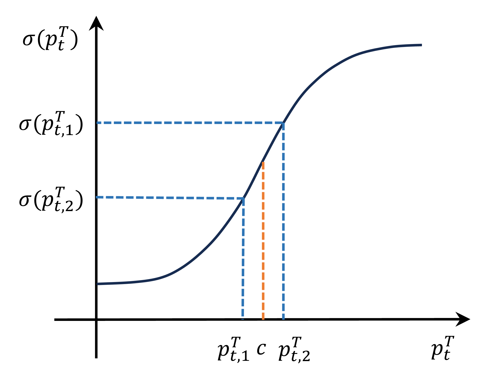

This repository includes official implementation for the paper: Gradient Scaling Knowledge Distillation: Alleviating Gradient Insensitivity to Enhance Non-target Class Learning (under review)

# Gradient Scaling Knowledge Distillation (GKD)
Prior research on knowledge distillation has primarily focused on enhancing the process through logits and feature-based approaches. In this paper, we present a novel gradient-based perspective on the learning dynamics of knowledge distillation, revealing a previously overlooked issue of **gradient insensitivity**. This issue arises when the varying confidence levels of the teacher's predictions are not adequately captured in the student's gradient updates, hindering the effective transfer of nuanced knowledge. To address this challenge, we propose **Gradient Scaling Knowledge Distillation (GKD)**, a method designed to mitigate gradient insensitivity by incorporating varying teacher confidence into the distillation procedure. Specifically, GKD adjusts the gradients of the student logits in accordance with the teacher confidence, introducing sample-specific adjustments that assign higher-weighted updates to the non-target classes of samples where the teacher exhibits greater confidence. Extensive experiments on CIFAR-100 and ImageNet demonstrate the superiority of our approach, particularly in heterogeneous teacher-student scenarios, achieving state-of-the-art performance on ImageNet. Moreover, GKD is versatile and can be effectively integrated with many logits distillation methods, providing a robust enhancement to existing methods. 🔗 **Code Repository**: [https://github.com/snw2021/GKD](https://github.com/snw2021/GKD)

### Framework

<p align="center">
  
  
</p>

### Main Benchmark Results

On CIFAR-100:

| Teacher <br> Student |ResNet56 <br> ResNet20|ResNet110 <br> ResNet32| ResNet32x4 <br> ResNet8x4| WRN-40-2 <br> WRN-16-2| WRN-40-2 <br> WRN-40-1 | VGG13 <br> VGG8|
|:---------------:|:-----------------:|:-----------------:|:-----------------:|:------------------:|:------------------:|:--------------------:|
| KD | 70.66 | 73.08 | 73.33 | 74.92 | 73.54 | 72.98 |
| **KD+ours** | **72.10** | **73.85** | **74.88** | **75.26** | **74.33** | **73.84** |


| Teacher <br> Student |ResNet32x4 <br> ShuffleNet-V1|WRN-40-2 <br> ShuffleNet-V1| VGG13 <br> MobileNet-V2| ResNet50 <br> MobileNet-V2| ResNet32x4 <br> MobileNet-V2|
|:---------------:|:-----------------:|:-----------------:|:-----------------:|:------------------:|:------------------:|
| KD | 74.07 | 74.83 | 67.37 | 67.35 | 74.45 |
| **KD+ours** | **75.15** | **75.61** | **69.17** | **69.04** | **76.24** |

On ImageNet:

| Teacher <br> Student |ResNet34 <br> ResNet18|ResNet50 <br> MobileNet-V1|
|:---------------:|:-----------------:|:-----------------:|
| KD | 71.03 | 70.50 | 
| KD+ours | 72.30 | 72.20 |
| DKD | 71.70 | 72.05 | 
| DKD+ours | 72.41 | 73.02 | 
| DOT | 71.72 | 73.09 | 
| DOT+ours | 72.35 | 74.08 | 

### Installation

Environments:

- Python 3.6
- PyTorch 1.9.0
- torchvision 0.10.0

Install the package:

```
sudo pip3 install -r requirements.txt
sudo python3 setup.py develop
```

### Getting started

0. Wandb as the logger

- The registeration: <https://wandb.ai/home>.
- If you don't want wandb as your logger, set `CFG.LOG.WANDB` as `False` at `mdistiller/engine/cfg.py`.

1. Evaluation

- You can evaluate the performance of our models or models trained by yourself.

- The teacher models are at <https://github.com/megvii-research/mdistiller/releases/tag/checkpoints>, please download the checkpoints to `./download_ckpts`

- If test the models on ImageNet, please download the dataset at <https://image-net.org/> and put them to `./data/imagenet`

  ```bash
  # evaluate teachers
  python3 tools/eval.py -m resnet32x4 # resnet32x4 on cifar100
  python3 tools/eval.py -m ResNet34 -d imagenet # ResNet34 on imagenet
  
  # evaluate students
  python3 tools/eval.p -m resnet8x4 -c download_ckpts/dkd_resnet8x4 # dkd-resnet8x4 on cifar100
  python3 tools/eval.p -m MobileNetV1 -c download_ckpts/imgnet_dkd_mv1 -d imagenet # dkd-mv1 on imagenet
  python3 tools/eval.p -m model_name -c output/your_exp/student_best # your checkpoints
  ```


2. Training on CIFAR-100

- Download the `cifar_teachers.tar` at <https://github.com/megvii-research/mdistiller/releases/tag/checkpoints> and untar it to `./download_ckpts` via `tar xvf cifar_teachers.tar`.

  ```bash
  # for instance, GKD method.
  python3 tools/train.py --cfg configs/cifar100/gkd/res32x4_res8x4.yaml

  # you can also change settings at command line
  python3 tools/train.py --cfg configs/cifar100/gkd/res32x4_res8x4.yaml SOLVER.BATCH_SIZE 128 SOLVER.LR 0.1
  ```

3. Training on ImageNet

- Download the dataset at <https://image-net.org/> and put them to `./data/imagenet`

  ```bash
  # for instance, GKD method.
  python3 tools/train.py --cfg configs/imagenet/r34_r18/dkd.yaml
  ```

4. Training on MS-COCO

- see [detection.md](detection/README.md)


5. Extension: Visualizations

- Jupyter notebooks: [tsne](tools/visualizations/tsne.ipynb) and [correlation_matrices](tools/visualizations/correlation.ipynb)


### Custom Distillation Method

1. create a python file at `mdistiller/distillers/` and define the distiller
  
  ```python
  from ._base import Distiller

  class MyDistiller(Distiller):
      def __init__(self, student, teacher, cfg):
          super(MyDistiller, self).__init__(student, teacher)
          self.hyper1 = cfg.MyDistiller.hyper1
          ...

      def forward_train(self, image, target, **kwargs):
          # return the output logits and a Dict of losses
          ...
      # rewrite the get_learnable_parameters function if there are more nn modules for distillation.
      # rewrite the get_extra_parameters if you want to obtain the extra cost.
    ...
  ```

2. regist the distiller in `distiller_dict` at `mdistiller/distillers/__init__.py`

3. regist the corresponding hyper-parameters at `mdistiller/engines/cfg.py`

4. create a new config file and test it.


# Acknowledgement

- Thanks for DKD and DOT. We build this library based on the [DKD and DOT's codebase](https://github.com/megvii-research/mdistiller)

